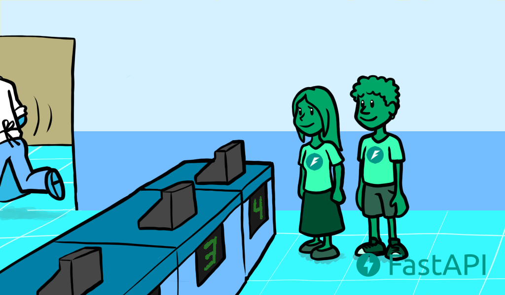

# Concurrency and async / await

Asynchronous code just means that the language has a way to tell the computer / program that at some point in the code, it will have to wait for something else to finish somewhere else. Let's say that something else is called "slow-file".

This idea of asynchronous code described above is also sometimes called "**concurrency**". It is different from "parallelism".

Concurrency and parallelism both relate to "different things happening more or less at the same time".

## Concurrency and Burguers 🍔

(I needed to put this here 💘)

### Concurrent (Asynchronous) Burguers 💑

You go with your crush to get fast food, you stand in line while the cashier takes the orders from the people in front of you. 😍


Then it's your turn, you place your order of 2 very fancy burgers for your crush and you. 🍔🍔


The cashier says something to the cook in the kitchen so they know they have to prepare your burgers (even though they are currently preparing the ones for the previous clients).


You pay. 💸

The cashier gives you the number of your turn.


While you are waiting, you go with your crush and pick a table, you sit and talk with your crush for a long time (as your burgers are very fancy and take some time to prepare).

As you are sitting at the table with your crush, while you wait for the burgers, you can spend that time admiring how awesome, cute and smart your crush is ✨😍✨.


While waiting and talking to your crush, from time to time, you check the number displayed on the counter to see if it's your turn already.

Then at some point, it finally is your turn. You go to the counter, get your burgers and come back to the table.


You and your crush eat the burgers and have a nice time. ✨


### Parallel Burguer


Now let's imagine these aren't "Concurrent Burgers", but "Parallel Burgers".

You go with your crush to get parallel fast food.

You stand in line while several (let's say 8) cashiers that at the same time are cooks take the orders from the people in front of you.

Everyone before you is waiting for their burgers to be ready before leaving the counter because each of the 8 cashiers goes and prepares the burger right away before getting the next order.


Then it's finally your turn, you place your order of 2 very fancy burgers for your crush and you.

You pay 💸.


The cashier goes to the kitchen.

You wait, standing in front of the counter 🕙, so that no one else takes your burgers before you do, as there are no numbers for turns.




As you and your crush are busy not letting anyone get in front of you and take your burgers whenever they arrive, you cannot pay attention to your crush. 😞

This is "synchronous" work, you are "synchronized" with the cashier/cook 👨‍🍳. You have to wait 🕙 and be there at the exact moment that the cashier/cook 👨‍🍳 finishes the burgers and gives them to you, or otherwise, someone else might take them.


Then your cashier/cook 👨‍🍳 finally comes back with your burgers, after a long time waiting 🕙 there in front of the counter.


You take your burgers and go to the table with your crush.

You just eat them, and you are done. ⏹


There was not much talk or flirting as most of the time was spent waiting 🕙 in front of the counter. 😞

> ⚠️ **This does not mean parallelism is worse than concurreny**. Concurrency is better on specific scenarios that involve a lot of waiting. Because of that, it generally is a lot better than parallelism for web application development.
>
> 🧹 If you have to clean your house, you're not waiting for anything. There may be turns (concurrency), but it's the same.
> 
> But in this case, if you could bring the 8 ex-cashier/cooks/now-cleaners, and each one of them (plus you) could take a zone of the house to clean it, you could do all the work in parallel, with the extra help, and finish much sooner.
>
>In this scenario, each one of the cleaners (including you) would be a processor, doing their part of the job

## async and await

`burgers = await get_burgers(2)`

**`await` tells Python that it has to wait for `get_burgers(2)` to finish doing its thing before storing the results in burgers**. With that, Python will know that it can go and do something else in the meanwhile (like receiving another request).

For `await` to work, it **has to be inside a function that supports this asynchronicity**. To do that, you just declare it with `async def` instead of `def`.

```py
async def get_burgers(number: int):
    # Do some asynchronous stuff to create the burgers
    return burgers

# NOT asynchronous
def get_sequential_burgers(number: int):
    # Do some sequential stuff to create the burgers
    return burgers
```

If a function is defined with `async`, then you have to call it with `await`. Otherwise, it won't work.

So, if you are using a library that tells you that you can call it with `await`, you need to create the path operation functions that uses it with `async def`, like in:

```py
@app.get('/burgers')
async def read_burgers():
    burgers = await get_burgers(2)
    return burgers
```

## Coroutines

Coroutine is just the very fancy term for the thing returned by an `async def` function. Python knows that it is something like a function, that it can start and that it will end at some point, but that it might be paused internally too, whenever there is an `await` inside of it.

But **all this functionality of using asynchronous code with `async` and `await` is many times summarized as using "[coroutines](https://en.wikipedia.org/wiki/Coroutine)"**. It is comparable to the main key feature of Go, the "Goroutines".

